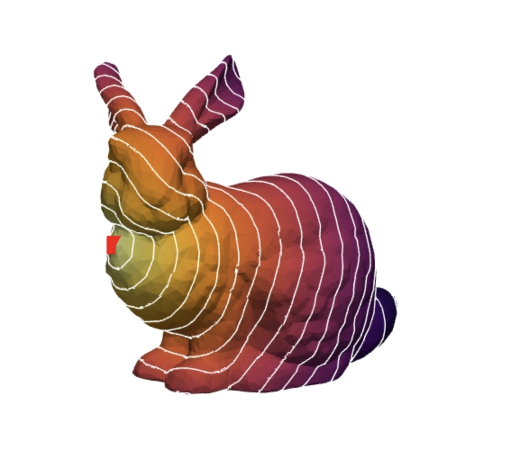
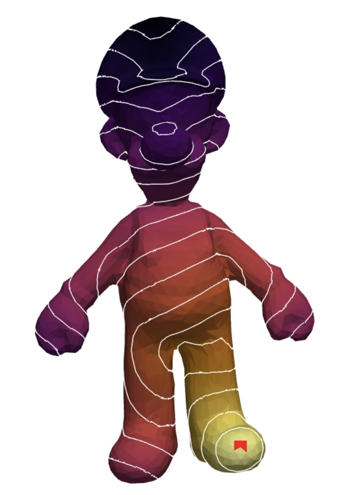
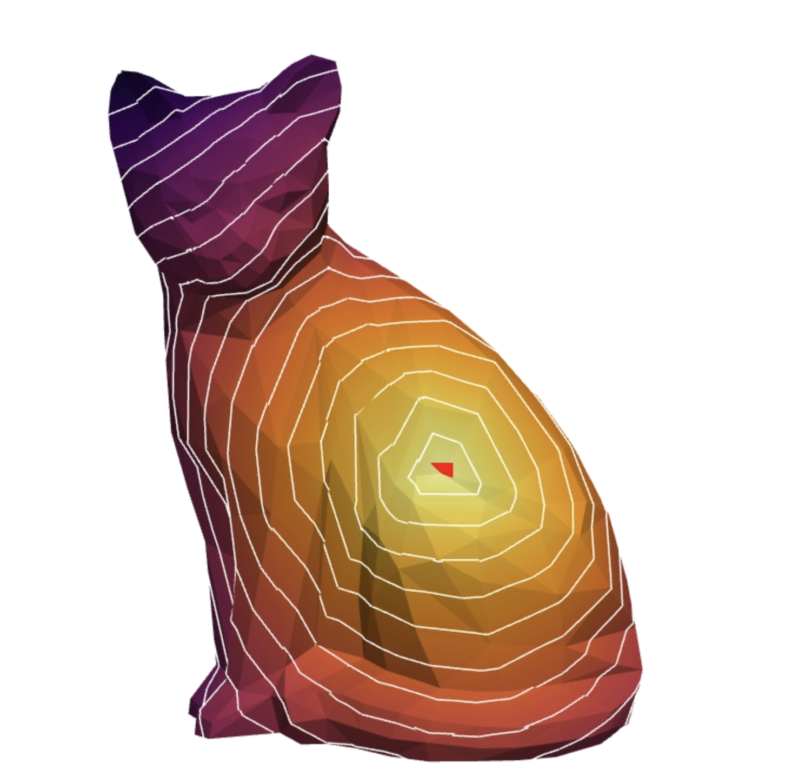

# The Heat Method for Distance Computation

This project implements the heat method for distance computation outlined in the paper *The Heat Method for Distance Computation* by Crane et. al. The code is structured similarly to the heat method algorithm described in the paper:

1. Integrate the heat flow $\dot{u} = \Delta u$ for some fixed time $t$
2. Evaluate the vector field $X = - \nabla u / | \nabla u|$
3. Solve the Poisson equation $\Delta \phi = \nabla \cdot X$

The main function that computes these steps is `compute_heat_flow(mesh, starting_point)`.

`mesh` is a string pointing to the directory of a mesh (i.e. "bunny.off")

`starting_point` is an int, representing the starting vertex of the heat flow.

## Code Overview

First the mesh is cleaned by removing any artifacts outside of the biggest component.

### Step 1:
For step 1 `integrate_heat_flow()` is called. This function returns $L_C$ and $\textbf{u}$, which are computed as follows:

$$(L_u)_i = \frac{1}{2A_i} \sum_j (\cot \alpha_{ij} + \cot \beta_ij) (u_j - u_i)$$

$L_C$ is the sum of $(\cot \alpha_{ij} + \cot \beta_{ij})$ taken over the neighboring vertices of vertex $i$. This is implemented as an $\mathbb{R}^{|V| \times |V|}$ sparse matrix where each entry $(i, j)$ holds the angle of $i$'s neighbor $j$. Similarly $A_i$ becomes a diagonal mass matrix $A$, which holds $\dfrac{1}{3}$ the sum of the neigboring faces to vertex $i$ at $(i, i)$ (this approximates the area of the mesh as each triangle has three vertices) $A \in \mathbb{R}^{|V| \times |V|}$.

$\textbf{u}$ is computed by solving: $$(A - t L_C)\textbf{u} = \delta_\gamma$$

Timestep $t$ is equal to $h^2$ with $h$ being the average edge length of the mesh (this was found to be a good estimate for $t$ in the paper). 

The Kronecker delta $\delta_\gamma$ is defined as a vector $\delta \in \mathbb{R}^{|V|}$, with the target point set as $1$ and the rest $0$, defining the origin of the heat flow. 

### Step 2:

For step 2 `eval_vec_field()` is called, from which $\nabla X$ is returned. First $X$ is constructed by finding the gradient of each $u_i$ using: 
$$\nabla u = \dfrac{1}{2 A_f} \sum_i (N \times e_i)$$

Where $A_f$ is the area for the face of the current triangle, whose vertices are iterated over. For each vertex $i$ in this triangle, $u_i$ is multiplied by the cross product of the opposite edge $e_i$ with the triangles unit normal $N$. From these $X$ vectors, we can find the integrated divergence $\nabla X$

$$\nabla X = \dfrac{1}{2} \sum_j \cot \theta_1 (e_1 \cdot X_j) + \cot \theta_2 (e_2 \cdot X_j)$$

Using the $X_j$ computed above, each face $j$ incident on the current vertex $i$ is iterated over, $e_1$ and $e_2$ are the edges containing $i$ and $\theta_1$ and $\theta_2$ are opposing angles.

### Step 3: 

`solve_poisson()` is called for step 3, where $\phi$ is solved for and returned using:  $$L_C \phi = b$$

$b$ is a vector $\in \mathbb{R}^{|V|}$ made up of each $\nabla X$ computed in step 2. Similarly, $L_C$ is the matrix from above.

# Results:

### Stanford bunny with starting point at vertex 100

### Luigi with starting point at vertex 1000

### Cat with starting point at vertex 100
